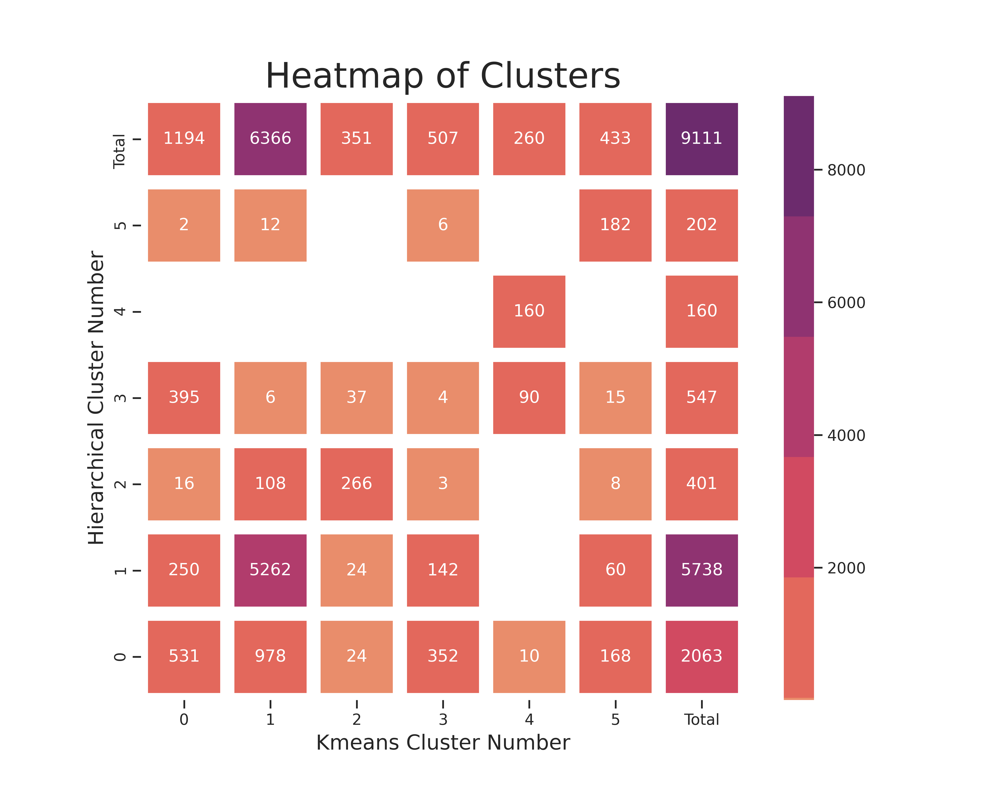

# How do I find the perfect RV campsite for ME?

by Hendrik Henning

Jun 09, 2021 

# Abstract

# Introduction

Finding the perfect RV camping spot can be a challenge for travelers with over 10 000 campsites to choose from in the US alone. This work would usually require a lot of research and planning, and often then you only see the camp site when you arrive. Perhaps you don't like a busy neighborhood or you prefer to have restaurants close by. Your unique preferences are hard to describe and this piles on top of the research to make it a daunting task to find that perfect spot.

RVing has become popular over the years as in addition to holiday goers some have opted in for an RV lifestyle to avoid mortgages, live simply, and allow for some traveling! For those that have overcome the challenges of small spaces and earning a consistent living while on the move this has become a dream come true. This project aims to help both holiday goers and permanent RVers a way of easily finding campsites that are similar to the ones they have found they liked.

# Data and Methods

Data science offers [tools](https://scikit-learn.org/stable/modules/clustering.html) that can categorize any group of objects into distinct groups. The tools will take several descriptive variables and find objects that are most similar and group them. There are various tools to use that group objects in different ways with different approaches. In this project, I will compare two different approaches, namely, Kmeans and Hierarchical clustering.

The [Kmeans](https://scikit-learn.org/stable/modules/generated/sklearn.cluster.KMeans.html#sklearn.cluster.KMeans) algorithm will take a predetermined amount of groups and fit the objects in the analysis to those number of groups as best it can. The measure that this algorithm uses to determine the best fit is by reducing the distance of objects in the cluster to the center of the cluster. This is done iteratively with starting points usually chosen at random and stops when the centers of the groups stop moving. The boundaries between groups tend to be straight lines and planes. Some strengths of the algorithm are that it is easy to visualize and utilize. Some drawbacks include fragmenting of groups through assuming that groups are well defined and easily separable.

The [agglomerative method of building hierarchical models](https://scikit-learn.org/stable/modules/generated/sklearn.cluster.AgglomerativeClustering.html#sklearn.cluster.AgglomerativeClustering) uses an approach that includes uniting two objects or groups that are most similar. Every single object starts as its own group and then gets paired as the algorithm moves through its iterative cycles. The algorithm ends when there is only one group after all groups have joined. A distance cut-off can be chosen and the various groups at that cutoff will be labeled separately. Some benefits of this method are that irregularly shaped clusters are seen as one cluster, another is that it is easy to see and understand how the clusters form through dendrograms.

The two algorithms will be evaluated by looking at the comparison of the different clusters generated.

The campsite data will be found online at the [poi-factory](http://www.poi-factory.com/node/17657) which holds a community-generated CSV list of campsites with GPS coordinates for GPS software. The campsite identity will be generated by using the [Foursquare API](https://developer.foursquare.com) to access data of surrounding venues, parks, and natural habitat data such as lakes and beaches. A radius of 4 kilometers will be chosen for the required data to include a wide variety of data points.

# Results

A total of 16 976 unique campsites in North America was identified and fed into the Foursquare API. A total of 146 388 locations were identified with 600 different categories of locations. 8112 campsites had no locations in a 4-kilometer radius. The remaining campsites and locations were then taken to generate models.

It was necessary to ensure both the Kmeans and hierarchical models give the same amount of groups to make comparisons between them easier. Iteratively solving the Kmeans and hierarchical models to achieve this gave 11 groups. [Figure 1]() shows the result from the analysis including the campsites that were found in both models as well as the groups the disagreed campsites were in.

Figure 1 - A Figure showing the relationship between the Kmeans and hierarchical models developed in a heat map. Totals are shown at the top and right for the corresponding cluster groups and models.

Table 1 shows the comparison results of the two groups. The Agreed number was calculated on the number of campsites that were in both models in the same group. The Total numbers are the total amount of campsites in each respective model. The agreed score was calculated by taking the number of agreed campsites and deciding by the model's total campsites for that cluster.

$AgreedScore = Agreed/Total Sites$

[Table 1 - A Table showing some comparative results for the 2 models developed](https://www.notion.so/b3da4a4ed4a84db8ab7310ec733168ac)

## Top 5 locations for the 12 Hierarchical clusters

[Table 2 - A Table showing the top 5 locations for each hierarchical cluster](https://www.notion.so/14c3dc6641254673b4c905c06f4b05ab)

## Map results from the hierarchical model

### Cluster 0

[https://henningh87.github.io/RVmaps/Cluster_0.html](https://henningh87.github.io/RVmaps/Cluster_0.html)

### Cluster 1

[https://henningh87.github.io/RVmaps/Cluster_1.html](https://henningh87.github.io/RVmaps/Cluster_1.html)

### Cluster 2

[https://henningh87.github.io/RVmaps/Cluster_2.html](https://henningh87.github.io/RVmaps/Cluster_2.html)

### Cluster 3

[https://henningh87.github.io/RVmaps/Cluster_3.html](https://henningh87.github.io/RVmaps/Cluster_3.html)

### Cluster 4

[https://henningh87.github.io/RVmaps/Cluster_4.html](https://henningh87.github.io/RVmaps/Cluster_4.html)

### Cluster 5

[https://henningh87.github.io/RVmaps/Cluster_5.html](https://henningh87.github.io/RVmaps/Cluster_5.html)

### Cluster 6

[https://henningh87.github.io/RVmaps/Cluster_6.html](https://henningh87.github.io/RVmaps/Cluster_6.html)

### Cluster 7

[https://henningh87.github.io/RVmaps/Cluster_7.html](https://henningh87.github.io/RVmaps/Cluster_7.html)

### Cluster 8

[https://henningh87.github.io/RVmaps/Cluster_8.html](https://henningh87.github.io/RVmaps/Cluster_8.html)

### Cluster 9

[https://henningh87.github.io/RVmaps/Cluster_9.html](https://henningh87.github.io/RVmaps/Cluster_9.html)

### Cluster 10

[https://henningh87.github.io/RVmaps/Cluster_10.html](https://henningh87.github.io/RVmaps/Cluster_10.html)

### Cluster 11

[https://henningh87.github.io/RVmaps/Cluster_11.html](https://henningh87.github.io/RVmaps/Cluster_11.html)

# Discussion

# Conclusion

# Appendix