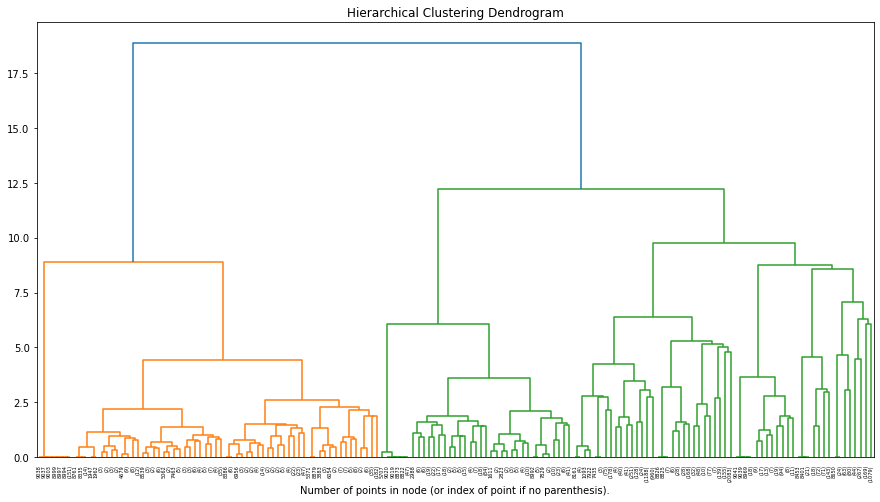
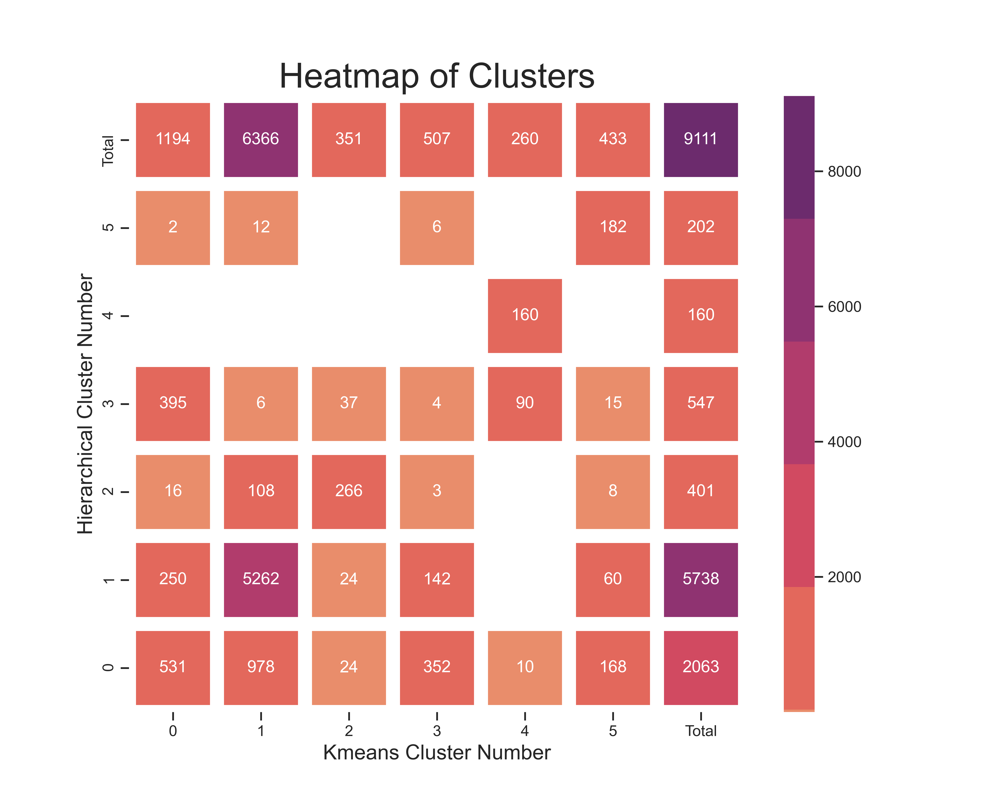

```{r setup, include=FALSE}
knitr::opts_chunk$set(echo = TRUE)
library(reticulate)
use_python('/Users/hendrikandcamila/Library/r-miniconda/envs/r-reticulate/bin/python')

```

# Abstract

Two clustering models of campsites were generated with the hierarchical model being superior to that of the Kmeans. The 6 clusters discovered showed distinct characteristics that users can use for planning their RV trips, namely:

- [A cluster with campsites in the city](https://henningh87.github.io/RVmaps/Agg/Cluster_1.html)
- [A cluster with clusters just outside the proximity of cities](https://henningh87.github.io/RVmaps/Agg/Cluster_0.html)
- 4 Nature clusters with various distinctions:
  - [Mountains and State Parks](https://henningh87.github.io/RVmaps/Agg/Cluster_5.html)
  - [Rivers, lakes, and beaches](https://henningh87.github.io/RVmaps/Agg/Cluster_2.html)
  - [Isolated campsites](https://henningh87.github.io/RVmaps/Agg/Cluster_4.html)
  - [An all-rounder cluster with a high variety of venues](https://henningh87.github.io/RVmaps/Agg/Cluster_3.html)
  
The model is still unrefined with many areas of improvement required before it can be used by the general public.

# Introduction

Finding the perfect RV camping spot can be a challenge for travelers with over 10 000 campsites to choose from in North America. A lot of time and research would usually be required to find the perfect spot and then the campsite is only seen when you arrive. Perhaps you don’t like a busy neighborhood or you prefer to have restaurants close by. Your unique preferences are hard to describe and this piles on top of the research to make it a daunting task to find that perfect spot.

RVing has become popular over the years as many have opted to live in RVs in addition to holiday goers that make up the traditional RV population. Some have opted in for an RV lifestyle to avoid mortgages, live simply, and allow for some traveling! For those that have overcome the challenges of living in small spaces and earning a consistent living while on the move this has become a dream come true. This project aims to help both holiday goers and permanent RVers with a way of easily finding campsites that are similar to ones they like or find the right campsite if they want to try something new. 

# Data and Methods

Data science offers [ many tools](https://scikit-learn.org/stable/modules/clustering.html) that can categorize any group of objects into distinct clusters. The tools will take several descriptive variables and find entities that are most similar and group them. In this project, I will compare two different approaches - Kmeans and Hierarchical clustering.

The [Kmeans](https://scikit-learn.org/stable/modules/generated/sklearn.cluster.KMeans.html#sklearn.cluster.KMeans) algorithm will take a predetermined amount of groups and fit the entities in the analysis to those number of groups as best it can. The measure that this algorithm uses to determine the best fit is by reducing the distance of objects in the cluster to the center of the cluster. This is done iteratively with starting points usually chosen at random and stops when the centers of the groups stop moving showing convergence. The boundaries between groups tend to be straight lines and planes. Some strengths of the algorithm are that it is easy to visualize and utilize. Some drawbacks include fragmenting of groups through assuming that groups are well defined and easily separable.

The [agglomerative method of building hierarchical models](https://scikit-learn.org/stable/modules/generated/sklearn.cluster.AgglomerativeClustering.html#sklearn.cluster.AgglomerativeClustering) uses an approach that includes uniting the two most similar entities/clusters at a time. Every single entity starts as a cluster and then gets paired as the algorithm moves through its iterative cycles. The algorithm ends when there is only one cluster that includes every entity and maps the iterative process in a dendrogram. A distance between joined clusters cut-off can be chosen and the various clusters at that cutoff will be labeled separately. Some benefits of this method are that irregularly shaped clusters are seen as one cluster, another is that it is easy to see and understand how the clusters form through dendrograms.

The campsite data was found online at the [poi-factory](http://www.poi-factory.com/node/17657) which holds a community-generated CSV list of campsites with GPS coordinates for GPS software. The campsite identity will be generated by using the [Foursquare API](https://developer.foursquare.com) to access data of surrounding venues, parks, and natural habitat data such as lakes and beaches. A radius of 4-kilometers will be chosen for the required data to include a wide variety of data points.

# Results and Discussion

```{python, include=FALSE}


import pandas as pd
import sqlite3
import numpy as np
import folium
import folium.plugins 
import matplotlib.pyplot as plt
import seaborn as sns
sns.set_theme(style="ticks")
import tabulate

con = sqlite3.connect('../Campsite_data_4k-all.db')
query = ''' SELECT A.Latitude, A.Longitude, A.Campsite_Name, Agg_Cluster_Labels, Kmeans_Cluster_Labels FROM Agg A, Kmeans K where A.Latitude = K.Latitude'''
df_RV = pd.read_sql_query(query,con)
con.close()
df_RV = df_RV.dropna()


```

```{python, include=FALSE}
range_i = list(range(1,int(df_RV['Agg_Cluster_Labels'].max()+2)))
df_clusters = []
for cluster in range_i: 
  df_clusters.append(df_RV[df_RV['Agg_Cluster_Labels'] == cluster-1])
  
cluster_stats = []
for cluster in df_clusters:
  temp = {}
  temp['Cluster'] = str(int(cluster['Agg_Cluster_Labels'].mean()))
  for i in range_i:
    temp[str(i-1)] = cluster[cluster['Kmeans_Cluster_Labels'] == i-1]['Kmeans_Cluster_Labels'].count()
  cluster_stats.append(temp)
df_cluster_stats = pd.DataFrame(cluster_stats).set_index('Cluster')

relabel_groups_list=[]
for i in df_cluster_stats.columns:
  relabel_groups_list.append(int(df_cluster_stats[df_cluster_stats[i].max() == df_cluster_stats[i]].reset_index()['Cluster'].values))

relabel_groups_list[3]=3
relabel_groups_list
df_RV['new_Kmeans_labels'] = df_RV['Kmeans_Cluster_Labels'].map(lambda x:relabel_groups_list[int(x)])

range_i = list(range(1,int(df_RV['Agg_Cluster_Labels'].max()+2)))
df_clusters = []
for cluster in range_i:
    df_clusters.append(df_RV[df_RV['Agg_Cluster_Labels'] == cluster-1])
cluster_stats = []

for cluster in df_clusters:
  temp = {}
  temp['Cluster'] = str(int(cluster['Agg_Cluster_Labels'].mean()))
  for i in range_i:
    temp[str(i-1)] = int(cluster[cluster['new_Kmeans_labels'] == i-1]['new_Kmeans_labels'].count())
  temp['Total'] = df_RV.groupby('Agg_Cluster_Labels').count().loc[int(cluster['Agg_Cluster_Labels'].mean())][0]
  cluster_stats.append(temp)
    
temp={}
temp['Cluster']='Total'
temp['Total'] = df_RV.groupby('Agg_Cluster_Labels').count().sum()[0]
for row in df_RV.groupby('new_Kmeans_labels').count().iterrows():
  temp[str(row[0])]=row[1][1]
cluster_stats.append(temp)

df_cluster_stats = pd.DataFrame(cluster_stats).set_index('Cluster')
```

```{python, include =FALSE, echo = FALSE, warning = FALSE, cache.lazy = FALSE}
f, ax = plt.subplots(figsize=(10, 8)), plt.axes()
cmap = sns.color_palette("flare")#sns.color_palette("light:#5A9", as_cmap=True)
# Draw the heatmap with the mask and correct aspect ratio
sns.heatmap(df_cluster_stats[df_cluster_stats.columns.tolist()].replace({0:np.nan}),
            annot=True,linewidths=10,
            square=True,
            center=3650,
            fmt='.0f',
            cmap = cmap).invert_yaxis() #400 635
plt.title('Heatmap of Clusters', fontsize = 25) # title with fontsize 20
plt.xlabel('Kmeans Cluster Number', fontsize = 15) # x-axis label with fontsize 15
plt.ylabel('Hierarchical Cluster Number', fontsize = 15) # y-axis label with fontsize 15
plt.savefig('Agg_Kmeans_corr.png',dpi=500)


```


A total of 16 976 unique campsites in North America was identified and fed into the Foursquare API to yield venue data. A total of 146 388 venues were identified with 600 different categories. 8112 campsites had no venues in a 4-kilometer radius and could not be clustered with the rest of the group. The remaining campsites and venues were then taken to generate the hierarchical and Kmeans models.


```{python echo=FALSE}
con = sqlite3.connect('../Campsite_data_4k-all.db')
query = ''' SELECT * FROM KmeansE '''
df_Kmeans_enqurie = pd.read_sql_query(query,con).drop('index',1)
con.close()
```

```{r, include =FALSE}
library(reticulate)
df_Kmeans_enqurie_r <- reticulate::py$df_Kmeans_enqurie
```

```{r include=FALSE}
pdf('Kmeans_elbow.pdf', width=10, height=6)
plot(df_Kmeans_enqurie_r[1:8,],
     type="b", pch = 19, frame = FALSE, 
     xlab="Number of clusters K",
     ylab="Total within-clusters sum of squares")
dev.off()
```


```{python echo=FALSE }
def return_totalOr(cluster):
  score = 0
  for row in df_RV.iterrows():
    if row[1][3]==i or row[1][5]==i:
      score = score +1
  return score

agreement_scores =[]
for i in list(map(lambda x:x-1,range(1,int(df_RV['Kmeans_Cluster_Labels'].max())+2))):
  temp= {}
  temp['Name'] = 'Cluster {}'.format(i)
  temp['Agreed'] = df_cluster_stats.iloc[i][i]
  temp['Total Hierarchical'] = df_cluster_stats.iloc[i][-1]
  temp['Total Kmeans'] = df_cluster_stats.iloc[-1][i]
  temp['Agreed Score (Hier.)'] = int(temp['Agreed']/temp['Total Hierarchical']*1000)/10
  temp['Agreed Score (Kmeans)'] = int(temp['Agreed']/temp['Total Kmeans']*1000)/10
  temp['Total in either model'] = return_totalOr(i)
  temp['Total Score (Hier.)'] = int(temp['Total Hierarchical']/temp['Total in either model']*1000)/10
  temp['Total Score (Kmeans)'] = int(temp['Total Kmeans']/temp['Total in either model']*1000)/10
  temp['Dominant'] = (lambda x: "Kmeans" if x>temp['Agreed Score (Hier.)'] else 'Hierarchical')(temp['Agreed Score (Kmeans)'])
  agreement_scores.append(temp)

df_scores = pd.DataFrame(agreement_scores).set_index('Name')
```


```{python, include=FALSE}
con = sqlite3.connect('../Campsite_data_4k-all.db')
query = ''' SELECT * FROM Agg_top_ten'''
df_Agg_top_ten = pd.read_sql_query(query,con).drop('index',axis=1).set_index('name')
query = ''' SELECT * FROM Kmeans_top_ten   '''
df_Kmeans_top_ten = pd.read_sql_query(query,con).drop('index',axis=1).set_index('name')
con.close()

rearrange_list = []
for i in list(map(lambda x:x-1,range(1,np.array(relabel_groups_list).max()+2))):
    temp =df_Kmeans_top_ten.iloc[relabel_groups_list[i]].to_dict()
    temp['name'] = '[Cluster {}](https://henningh87.github.io/RVmaps/Kmeans/Cluster_{}.html)'.format(i,i)
    rearrange_list.append(temp)
df_Kmeans_top_ten = pd.DataFrame(rearrange_list).set_index('name')
df_Kmeans_top_ten
df_Agg_top_ten = df_Agg_top_ten.reset_index()
df_Agg_top_ten['name'] = df_Agg_top_ten['name'].map(lambda x: '[{}](https://henningh87.github.io/RVmaps/Agg/Cluster_{}.html)'.format(x,x[8:]))
df_Agg_top_ten = df_Agg_top_ten.set_index('name')
```


The Kmeans model was evaluated first and the Elbow method found a distinct drop in the means squared distance plot when the number of Kmeans clusters reached 6 as seen in Figure 1. This change in slope indicates that the data is shaped to accommodate those clusters and that increasing the number of clusters will not gain much better separation. It must be noted that the Kmeans square means distance kept dropping significantly, even after the slope increased after 6 clusters, indicating that there are possible subgroups or that the data set has a large dispersion of data that are loosely connected.


The hierarchical model was then evaluated with 6 clusters as the cut-off point. The dendrogram is shown in Figure 2 and makes the visual inspection of the clustering simple. Two large clusters with a large inter-cluster distance break down into 4 clusters with 2 of those containing the majority of campsites, one in each parent cluster. These 2 larger clusters then break down into 4 subclusters, 2 each. The 6 clusters are significantly far apart from one another while still retaining significant cluster similarity within.




The Kmeans and hierarchical models were then evaluated and compared with one another. The heatmap showing the total of campsites in each model, as well as the differences and totals, are shown in Figure 3. Note that the diagonal displays campsites in agreement and the other nodes display campsites that were not, and in which cluster they were placed instead. Comparing the clusters to see common campsites gave the results shown in Table 1. The Agreed number was calculated on the number of campsites that were in both models in the same cluster. The Total numbers are the total amount of campsites in the cluster for each respective model. The agreed score was calculated by taking the number of agreed campsites and dividing by the model’s total campsites for that cluster.



$$AgreedScore = Agreed/Total Sites \%$$

```{r, echo=FALSE}
library(reticulate)
df_scores_r <- reticulate::py$df_scores
knitr::kable(df_scores_r[,1:5],"pipe",caption = "A Table showing some comparative results for the 2 models developed")
```


We see that both the Kmeans and the hierarchical models found similar groups, with similar numbers that have similar venues close by. Visual inspection of the Folium maps generated showed clear trends that were not explained by looking at the numbers and top 4 venues alone. This indicates that for most groups a large number of venues played significant roles in clustering the groups. Looking at the [Adjusted Rand Score](https://scikit-learn.org/stable/modules/generated/sklearn.metrics.adjusted_rand_score.html) we see a similarity of 0.486875, where a score of 1 would indicate identical clusters and 0 would indicate no similarities. There is a rough overlap statistically of the clusters.

The results show that the models agree with clusters 1, 2, and 4 and that cluster 3 had almost no similarities. For clusters 4 and 5, the hierarchical model had a large percentage of the cluster entities included where the Kmeans model had a significantly smaller population. This suggests that the Kmeans model could have been unable to isolate the cluster due to its size and its close proximity to another cluster, or clusters. The Kmeans model is unable to discriminate well against clusters close in proximity and odd shapes, whereas the hierarchical model navigates these challenges more comfortably. This is the first indication that the hierarchical model is a better fit for the classification of campsites.


```{python include = FALSE}
from sklearn.metrics.cluster import adjusted_rand_score
ARI_score = adjusted_rand_score(df_RV['Agg_Cluster_Labels'].to_numpy(), df_RV['new_Kmeans_labels'].to_numpy())
```

Investigating the maps generated and venues it was seen that Clusters 0 and 1 had a high percentage of campsites in both models, indicating a high concentration of points that are distinct from the other clusters and very similar to one another. Looking at cluster 1 briefly one can see that it has many campsites in urban areas and would suggest a high concentration of venues close to the campsite.

The top 4 venues of each cluster in each model were then calculated and tabulated and can be seen in Tables 2 and 3. This data would allow an easy comparison between the venues in the cluster and would give an indication what kind of campsites each cluster holds.


```{r, echo=FALSE}

df_Kmeans_top_ten_r <- reticulate::py$df_Kmeans_top_ten
df_Agg_top_ten_r = reticulate::py$df_Agg_top_ten
options(knitr.kable.NA = '')
knitr::kable(df_Agg_top_ten_r[,1:4],"pipe",caption = "A Table showing the top 4 sites for each Hierarchical cluster. Links go to interactive map results hosted on GitHub Pages")
knitr::kable(df_Kmeans_top_ten_r[,1:4],"pipe",caption = "A Table showing the top 4 sites for each Kmeans cluster. Links go to interactive map results hosted on GitHub Pages")

```


Cluster 1, as noted before showed a high degree of similarity with venues that include restaurants, hotels, and convenience stores. When looking at cluster 4 which was highly contested we see that the hierarchical model included only campsites that have other campsites in its vicinity. There are no other venues included in this cluster for this model. The Kmeans cluster 4 included many other venues around the campsites, and shows that the Kmeans model could not isolate this group sufficiently. 

The other clusters show some similarities in that the campsites tend to be away from towns and cities, and include a preference for certain types of nature spots. These will be discussed further below. When investigating further we see that the Kmeans top venues for the other clusters include venues that are similar in some of the other clusters, where the hierarchical model does not have this. This would suggest that the Kmeans model was not able to separate the groups significantly in order to achieve clear and distinct preferences.

From the evaluation, it was decided to use the hierarchical model for the identification of the clusters. The groups seem more distinct and uniform.

## Group Descriptions

The aim of this project is to classify the clusters generated and describe them for others to use the information. This section aims to deal with the description of the clusters. This was done by looking through top venues and investigating the maps visually for trends. These maps can be found on the project's GitHub page and are served over the internet for free access.

### [Cluster 0](https://henningh87.github.io/RVmaps/Agg/Cluster_0.html) - A little out the way

Cluster 0 offers campsites that are close to populated areas but not quite in them. There are fewer very close venues than cluster 1, which has the highest density of clusters in its 4-kilometer radius, but there are more venues around than the other clusters that are in isolated spots. 

This kind of cluster is well suited for people that would like to have a little peace and quiet, but not give up on any conveniences such as having stores and gas stations close by. Most would be able to find a campsite not too far from home and could cut down on holiday traveling time. 

For permanent RVers, this cluster presents the opportunity to stay a little out of a destination city, while still enabling work opportunities due to the relatively close proximity of the campsites.

This is why I call this cluster, the "A little out the way" cluster.
 
### [Cluster 1](https://henningh87.github.io/RVmaps/Agg/Cluster_1.html) - City Dwellers

Cluster 1 has a very high amount of campsites with 5738 out of the total 9111. This would indicate a very dense entity population of campsites in the cluster, and upon inspection, we can see that many of the campsites are in populated areas with many venues in a 4-kilometer radius.

The RV camper that wants to be close to many different stores and have the convenience of many spots to choose from would travel to spots in this cluster. Rvers that do migratory work and part-time jobs in many towns and cities would find this cluster recommended. You would be in the hustle and bustle of the city, and because of the high amount of campsites would allow the RVer to be more choosy about the campsite.

Do you feel comfortable living in the city? Then this cluster of campsites is for you.
 
### [Cluster 2](https://henningh87.github.io/RVmaps/Agg/Cluster_2.html) - Wet and wild

Cluster 2 contains a large number of campsites that have water close, Lakes, rivers, and the ocean as examples. In addition, many have State parks and would give you the ability to experience untouched nature.

This cluster is a little bit away from populated areas and would not suit migratory workers and possibly those that depend on high-speed internet very much. If you need to work or stay long term this will most likely not suit you very well. 

Families with children that love to go out and swim or kayak would possibly prefer this kind of cluster over the others. This cluster allows for many such adventures away from the crowded RV space. Going on holiday or traveling stays might be ideal for those that want to stay at these campsites for a couple of nights.

This is why I have labeled this croup as "Wet and Wild".

### [Cluster 3](https://henningh87.github.io/RVmaps/Agg/Cluster_3.html) - The All-Rounder

Cluster 3 campsites tend to have a large variety of venues close by including State Parks, lakes, mountains, and some are even a 15-minute drive from populated places. If you're someone that likes keeping things open-ended and plan your activities on the morning or day before this is the cluster for you.

Due to the variety of the different venues in this cluster, a little bit more research would be required by the RVer to make sure that they get their needs met while staying at the campsite. Do you need to work? Do you want to hike over trails? Do you have children that need a lot of adventurous activities? You'll need to make sure you get the right spot for you.

This is why I called this cluster "The All-Rounder".

### [Cluster 4](https://henningh87.github.io/RVmaps/Agg/Cluster_4.html) - Popular Isolated Nature Spots 

In Cluster 4 we only see other campsites in the 4-kilometer vicinity and no other venue type. These spots tend to be isolated, yet popular due to the higher concentration of campsites. Some of these spots have 4 to 6 campsites in the 4-kilometer radius. 

The increased popularity could indicate frequent travelers or isolated nature spots that are easily accessible. In short, you are deep in nature, but not too far away from other travelers. These touristic sites would offer many adventures as frequent visitors would allow a local economy to build up around the travelers. 

These spots might be ideal for a week-long getaway or for those looking at meeting like-minded people that want to get away from the city.

This is why I called this cluster "Popular Isolated Nature Spots".

### [Cluster 5](https://henningh87.github.io/RVmaps/Agg/Cluster_5.html) - RV with a view?

Cluster 5 campsites have a high concentration of mountains and State Parks. These campsites have plenty of breathtaking views and trails to choose from. The State Parks offer a true-in-nature experience and will help anyone relax and do some soul searching. 

Due to the isolated nature of these spots, many permanent RVers will struggle to get employment at these locations and so this cluster will be more suitable for temporary stays and holiday goers.

Do you need an "RV with a view?"


## Limitations of the model and study

The clustering of campsites yielded acceptable results with some areas of concern. Two clusters are very large in size with a high probability of large subgroups and greater distinction. In comparison, the in-nature clusters are much smaller than these large clusters and have many similarities between themselves which could make them feel relatively similar. 

Another very big point of concern was the very large group of campsites with no venue in a 4-kilometer radius. These sites may show many similarities with the clusters generated due to their venues being just outside the chosen 4-kilometer range. 

In order to improve on the result, the study should be modified to include a very large area radius of venue information. This radius size can be optimized in order to ensure that every single campsite has at least one entry. Further, a scoring system can be developed where nearer venues would score higher so that the campsites with a high concentration of very close venues would still be grouped together.

It might also be very beneficial to perform the clustering and generate fewer groups, let's say 3 or 4 - a number that can be optimized, and then perform clustering for a second round on the generated clusters in order to separate them into subgroups which would be easy for users to understand. This would feel more like a decision tree in which many options are presented in a linear flow of distinction branches. For example, one could have the first branch be the distinction of having a campsite within the confines of a city or outside of it. 

Further, the model and descriptions are at present only in a report form with maps that are hard to access only through links and no user interface, and therefore a website with easily accessible descriptions and maps would allow the model to be accessed by the public, which would benefit from the results.

# Conclusion

The clustering of campsites was achieved with moderate success and a successful hierarchical model was generated. The hierarchical model proved superior to the Kmeans model that gave similar numbers of clusters but was found to mix the groups and give less distinction to each group. This was particularly pronounced with smaller groups. 

Further work could be done to improve this model and expand on its capabilities, namely scoring venues according to distance and allowing a larger radius for venues to be recorded and modeled. There is also the possibility of assigning subgroups if they are distinct enough. The project shows some promise to be used as an app or website for RVers to find suitable campsites that suit them personally.


